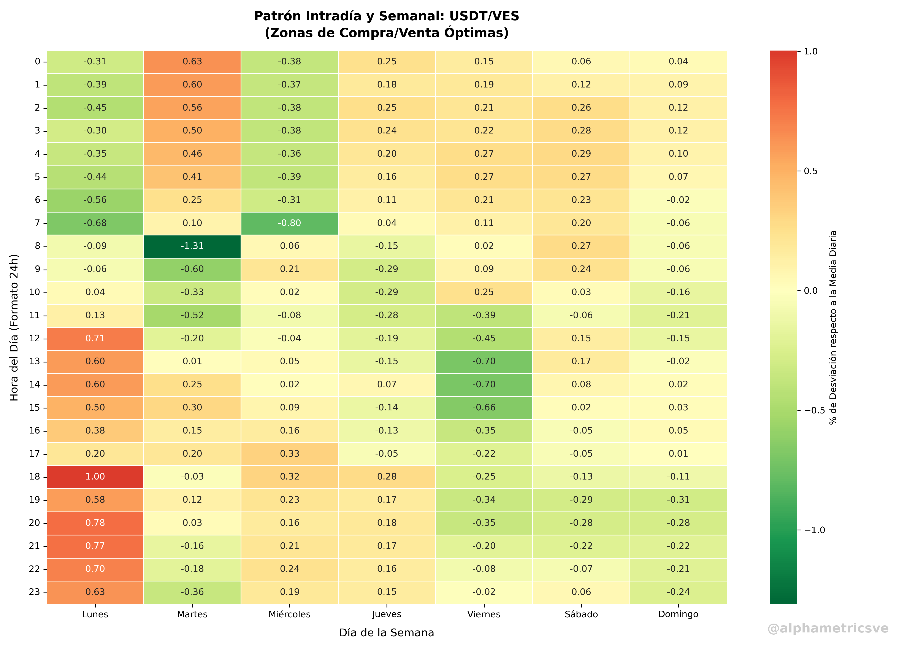

# Microestructura de Mercado Intradía: Optimización Horaria en la Ejecución de Transacciones USDT/VES

### 1. Pregunta de Investigación
¿La cotización del USDT en los mercados P2P locales fluctúa de manera puramente estocástica (aleatoria) a lo largo de las 24 horas del día?

### 2. Objetivo
Identificar y mapear las ventanas horarias y diarias estadísticamente óptimas para la compra y venta de USDT/VES, minimizando el costo de deslizamiento (*slippage*) transaccional.

### 3. Justificación
Para las tesorerías corporativas que gestionan flujos de caja operativos en economías multimoneda, ejecutar órdenes en momentos de distorsión de precios genera ineficiencias de costos ocultos. Optimizar el *timing* de ejecución representa un ahorro marginal de alto impacto corporativo al manejar volúmenes transaccionales medianos y altos.

### 4. Metodología y Resultados
La muestra utilizada para este desarrollo comprende el registro histórico transaccional extraído de **Binance P2P** como principal referencia de liquidez en el entorno local. 

El script aplica un proceso de *detrending* calculando una media móvil centrada de 24 horas para aislar el factor de la devaluación macro. Posteriormente, evalúa estadísticamente el porcentaje de desviación de cada franja horaria respecto a dicha mediana diaria. 

### 5. Limitaciones del Análisis
* **Dinámica de spreads cambiantes:** El modelo analiza la desviación del precio medio, pero no incorpora la profundidad de las puntas (*order book depth*).
* **Estacionalidad macro exógena:** Choques imprevistos en la liquidez monetaria de la banca pueden generar distorsiones temporales sobre los patrones aquí expuestos.
